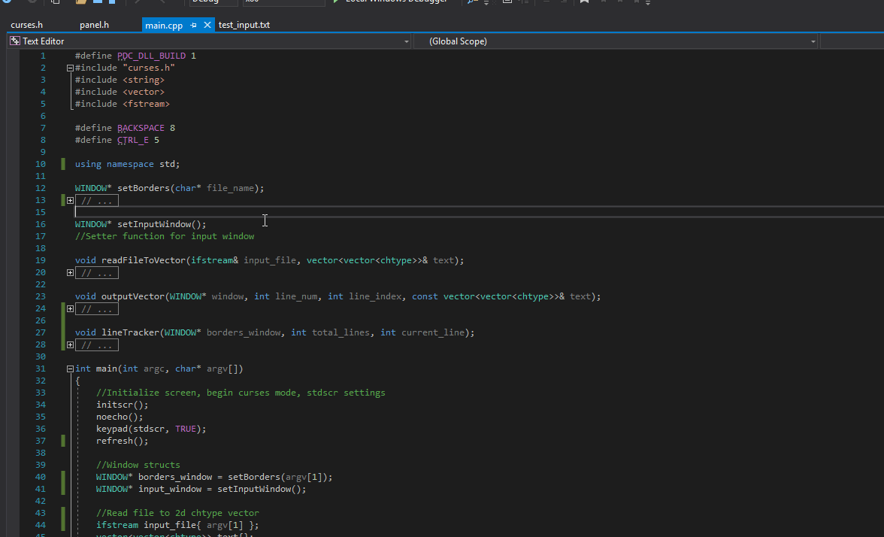

# Design Diary
So this last chunk was slower and more painful than the last. After a terrible loss of progress from an accidental branch deletion, I had to rebuild a lot of my code from scratch over just a few days. This allowed me to reformat my program for the better, I hope, but was understandably frustrating. 

Currently my text editor supports reading in a file name from the command line and displays the corresponding file name in the status bar. This file is then converted to a two-dimensional vector; a vector of vectors of chtypes. I treat this data structure as a vector of character strings ending in a newline character in my program. The two-dimensional structure helped to visualize how the file data will be displayed in a Curses window, which shares a similar LINES x COLS structure. It also helped immensely in implementing cursor movement that corresponded with the user’s position in the actual data. Having each line be a vector in itself will also make line edits easy in the future with vector insert functions etc.

However, while a two-dimensional vector fit the text display well, the specifics of getting it to output properly was a headache. Nested for loops are no joke, and even after getting the output function to “work” as well as I could, I doubt I could replicate it without a reference. The larger this project gets the more I find myself wanting to scrap everything and try to build it “cleaner”, but I know that’s probably naïve. 

For file contents that do not fit within the input window, I have implemented vertical scrolling in my editor. This was much harder than I thought it would be, and required tracking multiple variables as the user moves the cursor through the window (cursor y, cursor x, vector index locations etc.) that I did not foresee. It also required a significant reformatting of the vector output function to include cursor position as well. The current line number is displayed in the lower right of the screen to keep track of user location in the file, and proper bounds checks are done to ensure the user can’t scroll out of the text vector’s range. 

In the spirit of emulating simple text editors like notepad or nano, I wanted my editor to have horizontal scrolling rather than wordwrap, but I was unable to successfully implement it for this milestone. I thought it would be of similar difficulty to vertical scrolling (which was hard in itself) but it proved far more difficult. I hope to have it implemented by the next check in date.

# GIF of Progress

