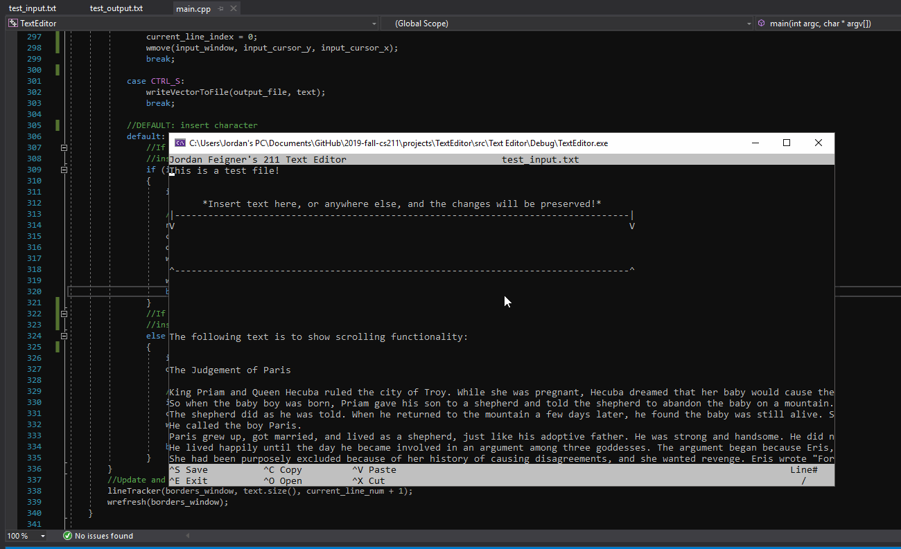

# Milestone 3 Design Diary

The development process of this milestone has been smooth. After implementing basic text output and vertical scrolling in Milestone 2, adding horizontal scrolling and basic text editing for this Milestone was surprisingly pain-free.

My editor design is still following nano very closely, and in that spirit, I wanted to implement horizontal scrolling instead of word wrapping. The main conceptual challenge of this method was the problem of conserving information that is no longer on screen. For example, the gap between lines caused by newline characters must be preserved, even if those newline characters are currently outside the bounds of the window. It was a small miracle that my vector output function was robust enough to preserve this information without requiring a significant refactoring. It was a huge confidence boost to just throw my existing function into new circumstances and see it perform as I wanted it to. I hope these moments happen more frequently as I become more experienced with programming. That might be wishful thinking.

Though it wasn't required for this milestone, I also added window resizing to my editor. I mention this because adding this feature required a significant rewrite of my cursor movement bounds checking logic. At the time I thought my checks were bulletproof, but a small change in the environment proved me wrong. This was another learning opportunity for me as a programmer, and it has made me more aware of possible edge cases during logic design.

I am still currently storing file data in a two dimensional vector of chtypes, with each sub vector being terminated by a newline character. I am positive that it was this structure that made horizontal scrolling so easy to implement. However, because I don't use word wrap, it is often the case that a line will go off screen one character at a time as the user inserts characters. Because of this, I save my vector data after EACH input by the user to prevent data loss and to make my life easier during these early stages of development. I will hopefully implement a robust buffer system later in my design to avoid this inefficiency. I was, however, able to ensure that only a single sub vector (line) is updated at a time, which (I believe) makes my inserts O(n) rather than O(n^2) as it would be if a I had to iterate through the whole two dimensional vector after every input.

However, in order to display the changes made by the user, I redraw the entire vector to the screen after each user input. My program tracks what I call "render coordinates", which are two integers representing the imaginary i and j values (index locations) within the text vector from which to begin drawing from. The output function iterates through the vector starting at this [i][j] location and outputs whatever can fit within the window. Note that these index locations do NOT have to be an actual location in the vector. I am unsure of how efficient my method is. I suspect it is O(n^2) because I am iterating through every fillable coordinate in the display window. I may come up with a more efficient way to output later.

Finally, I output my data, with changes, to a separate text file in much the same way I read in the data; by iterating through the 2d vector with a nested for loop. I tried to get this loop working with iterators, but they don’t seem to play well in the two-dimensional structure.

As it stands, I am very happy with my design. There are still some bugs and generally wonkiness creeping into my project, and my issues page keeps growing every milestone. My code is also in need of a significant refactoring. I hope I have some time in the near future to clean everything up.

# GIF of Progress

